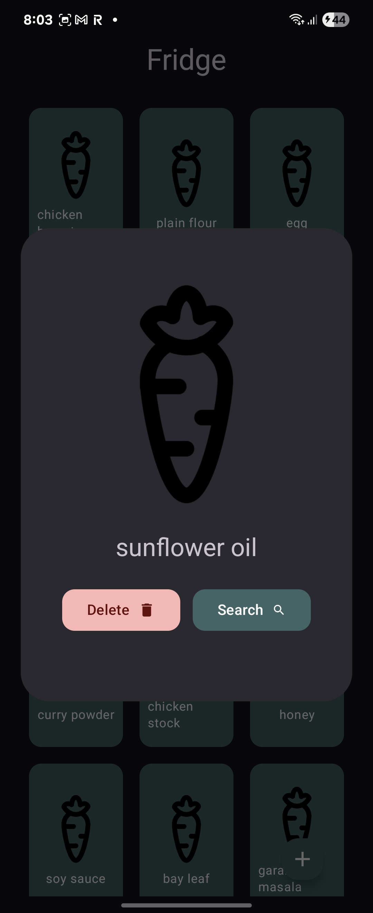
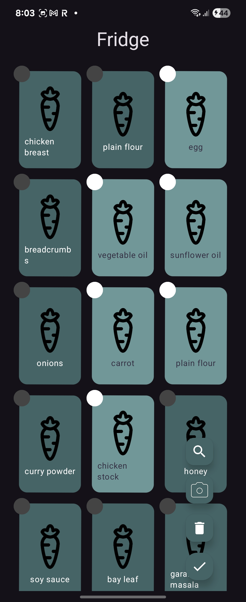

<h1 align="center"> ReciMe </h1>

    

An app to help you pick your next meal!

--- 

## About 

ReciMe was designed because I am very indecisive with what I want to eat. Instead of having a recipe book or something else, I decided to build an app to help me do that for me. Recime me has 3 main ways to help users chose what to eat. 

1. Randomly!
2. Based on categories an restrictions (i.e only chicken or only breakfast foods, etc)
3. Based on ingredients users have in their fridge or laying.

## Home Page

The home page has the daily dish which is a randomly chosen dish that refreshes every day. This dish can be absolutely anything including deserts! 

    

When pressing on 'more info' the users are navigated to the Recipe view where it shows all of the information about the dish and even a youtube video containing instructions on how to make the dish.

    
    

The user can also go to the fridge which contains all of the ingredients the user has or needs for a recipe, or the user can navigate to the categories view to have a narrower search 

## Fridge

    

Here the user can see all of the groceries (note that the images for most ingredients are to be added soon and that the carrot is just a placeholder). 

Here the user can double tap on any product to view them and be ale to create a single search or delete them.

    

along side the user can long press on any of the ingredients to select multiple ingredients to be either search to search a meal for or to be deleted. The user can also delete all of them at once by just pressing the trash can button

if the user searches without selecting any item, the search
will be done at random.

    

When adding new ingredients the UI displays currently added ingredients to avoid duplication but if the user chooses so, they can multiple instance of the same ingredient(s). 

    
    

## Category finder 

TODO

## Recipes List

Almost all views lead to this list. No matter how it is
the user should always have a similar UI. This view displays
the suggested meals, whether it be by category, ingredient,
name or by random. 

    

The list is lazy loaded and by default will be as long as 
the response is from the backend server. When clicking on any meal, it will show a more detail version as mentioned before. 

if the user decides to go back from the detail version to here, the list stays the same with zero to no lag or loading time. 

----

## Technical Review

Documentation for this project can be found 
[here](https://nikolay-ts.github.io/ReciMe/)

### Fetching Data

This is the first app that I have made the relies mostly on an API to work. This was a great learning experience as most apps are dynamic and almost always need a reliance on a backend. 

For this I used a singleton object called Client that handled all of the async requests and convert the JSON objects to data classes using my custom serializers. 

The biggest challenge at the beginning was the waiting time. On a mobile device the waiting time seems more longer than on a web application, so my main gaol was to lower down the loading time. The basic meal requests were lightweight and fast, but when fetching the images, that is when it could take up to 10 seconds to load in the data. 

To lower down the loading time I did two things

1. Implement my own singleton object to act as a `cache`
2. Using threads to make the fetching of data concurrent. 

#### Caching

I made my own object named `TempStorage` that had the meals, chosen meal and their images stored so that when the user wanted to go back and forth without having new meals, the app would not have to make new requests each time. That sped things up a lot but did not solve the problem of slow fetching of data. 

By using multiple threads and joining them at the end to fetch the data and images I was able to cut down the waiting time from 10 seconds to less than a second. This was very beneficial and relatively simple because I made
my fetching functions async to begin with and the Kotlin's coroutines are much easier to use than other async APIs.

### Using Computer Vision To Detect Ingredients on Screen

This is still in development, but I wanted to find and fine tune a computer vision (CV) model to be able to do this on my backend. For this I chose to use YOLO as it is the state of the art and very simple to use with python and FastAPI for my backend. 

### Responsive Scalable UI

Another issue I knew I would come up with is the fact the, a user could have countless recipes and (more likely) countless of ingredients. This meant that rendering them could be a big issue and was at the beginning especially when animating a shaking effect on long presses in the `fridge` view. 

To mitigate such lag I used lazy loading to only make sure the Jetpack Compose only loaded the necessary elements to the screen. 

The animation wiggling was handle in a separate worker to not overload the main I/O thread thus mitigating input lag when the user tries to select or deselect an item. 

### Passing Data Across Views

A lot of my views had to pass data to each other such as:
meal names to fetch more precise data about them, meal options and restrictions to search, ingredients to search and more. This meant that data had to be communicated somehow between views. Jetpack Compose does have its own solution, but since I had already integrated my `TempStorage` solution and knew this data was not needed to be persistent I decided to use it instead.

I believe that this was the right choice here as the other methods such as `DataStore` and `ShareViewModel` would have added unnecessary complexity and overhead to the project, when a global singleton of data storage `TempStorage` was already in use. However for future projects, I would like to use the native options and compare the benefits and drawbacks of using them